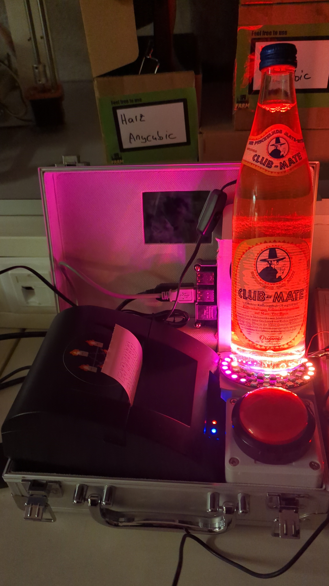

# 🧾 Fortuna AAI



Press **Enter**, print a paper fortune.  
This tiny Python script sends a procedurally generated fortune to a POS58 USB thermal receipt printer.

## ✨ Features

* Generates playful “science-and-software” themed fortunes  
* Works out-of-the-box with the common **0x0416 : 0x5011 POS58** thermal receipt printer  
* ASCII art logo or robot for extra delight  
* Simple keyboard trigger (the **Enter** key)  
* Fortune lists are plain Python lists—edit freely

---

## 🛠️ Hardware

Any ESC/POS-compatible thermal printer that shows up as a USB bulk device should work if you adjust the `idVendor` / `idProduct` values.

## 📦 Dependencies

```bash
pip install pyusb keyboard

## Developer

@DJE98
@busy-age
